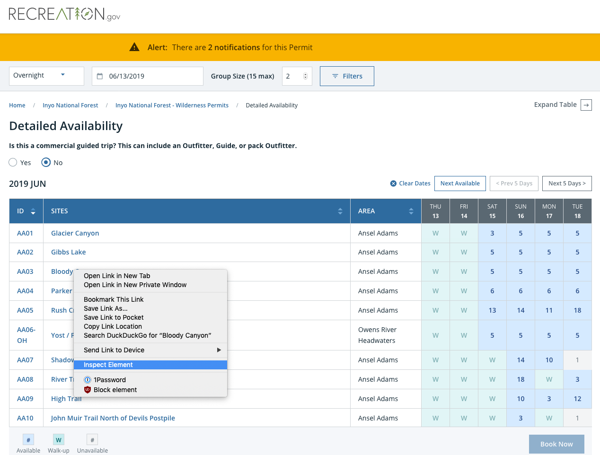
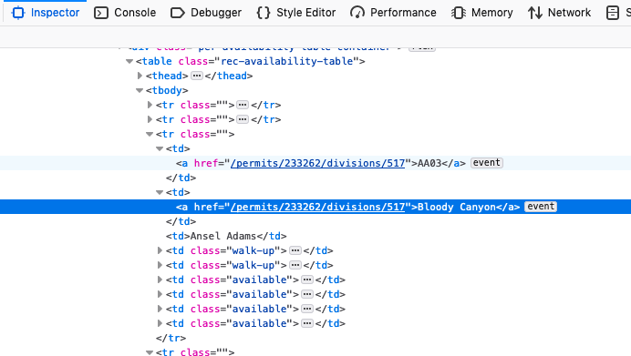

# Overview
Simple script to check permit availability for a desired date and trail in Inyo National Forest and send a text message if a permit becomes available. In other words, this saves you having to check back on the website periodically to see if a permit has become available.

# Setup
## OSX
### Assuming >= python3.6 is not already installed:
```
brew install pyenv
brew install pyenv-virtualenv

# at this point you should add what pyenv-virtualenv tells you to your ~/.bash_profile

# Refresh your session
source ~/.bash_profile

# pyenv install is broken on OSX 10.14.3
CFLAGS="-I$(xcrun --show-sdk-path)/usr/include" pyenv install 3.7.3
git clone https://github.com/dominic-rossi/recreation-checker.git
cd recreation-checker
pyenv virtualenv 3.7.3 recreation-checker
echo "recreation-checker" > .python-version
pip install .
```

### If you already have >= python3.6 installed:
```
git clone https://github.com/dominic-rossi/recreation-checker.git
cd recreation-checker
pip install .
```
Feel free to substitute your preferred virtual environment creation method before running `pip install`.


Next you will need to create a `.env` file with the following contents:
```
TWILIO_SID=""
TWILIO_TOKEN=""
TWILIO_PHONE=""
DEST_PHONE=""
TRAIL_INDEX=""
DATE_OF_INTEREST=""
```
The twilio values will come from your [twilio console](https://www.twilio.com/console). `DEST_PHONE` should be your phone number. `DATE_OF_INTEREST` should be the date of the permit you would like to search for, in the following format: YEAR-MONTH-DAY. If you wanted to search for permits on June 7, 2019, this would be `2019-06-07`, with a zero-padded month and day. To find the value for `TRAIL_INDEX`, which will correspond to the trail you would like to obtain permits for: 

1. Visit [this url](https://www.recreation.gov/permits/233262/registration/detailed-availability?type=overnight-permit&date=6/13/2019).
2. Enter your group size and answer the question about being a commercially guided trip.
3. Find the row in the table corresponding to the site for which you would like to reserve a spot and right click the row and select "Inspect element":

4. Find the number at the end of the url. In the example below, the number is 517, and so you would set `TRAIL_INDEX="517"` in your `.env` file.


# Run
```
python check_availability.py
```

# TODO:
* Error handling. There isn't any, so don't screw up.
* Add a logger. But none of that basicConfig nonsense.
* Tests. Maybe. What is this, work? I thought we were having fun here.
* Comments/docstrings would make things easier.
* Support multiple recreation.gov sites. Currently the URLs are hardcoded for Inyo National Forest.
